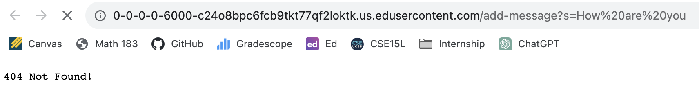

# 1. cd
  1-1. the command with no arguments\
  \
  The working directory was nothing when the command was run. cd means to change the current directory to the given path. Therefore, since there was no argument, we can't switch the current directory and that's why nothing happened when the command was run. The output is not an error.\
  1-2. the command with a path to a directory as an argument\
  \
  The working directory was messages when the command was run. It is because the current directory was switched to messages from lecture1. The output is not an error.\
  1-3. the command with a path to a file as an argument\
  
  There wasn't any working directory when the command was run because en-us.txt is a file not a directory. Output is an error because when we use cd, we are supposed to switch the current working directory to the given path. However, since en-us.txt isn't a directory, it doesn't switch to a different directory when we typed cd, and it's not doing what it's supposed to do, so I would consider it an error.\

# 2. ls
   2-1. the command with no arguments\
   \
   The working directory was /home/ when the command was run. It is because lecture1 directory is under /home/ directory and ls shows the files and folders in the given path. The output is not an error.\
   2-2. the command with a path to a directory as an argument\
   \
   The working directory was lecture1 when the command was run. It is because messages directory, Hello.class file, Hello.java file, and README file were under lecture1 directory and ls shows the files and folders in the given path with was lecture1. The output is not an error.\
   2-3. the command with a path to a file as an argument\
   \
   The working directory was /home/lecture1/Hello.java when the command was run. It is because it is the only file under the /home/lecture1/Hello.java directory. The output is not an error.\

A screenshot or Markdown code block showing the command and its output\
What the working directory was when the command was run\
A sentence or two explaining why you got that output (e.g. what was in the filesystem, what it meant to have no arguments).\
Indicate whether the output is an error or not, and if it’s an error, explain why it’s an error.\

# 3. cat
   3-1. the command with no arguments\
   \
   The working directory was /home/ when the command was run. cat prints the contents of one or more files given by the path, but since there is no argument, it can't print anything. That's why there is nothing when the command was run. Output is not an error.\
   3-2. the command with a path to a directory as an argument\
   \
   The working directory was messages when the command was run. I think the output was like this because messages has three text files but the given path was the only directory, not a specific file so it's showing Is a directory. I think it is an error because cat is used to print the contents of files given by the path, but none of the files are given by the path. The path is just a  directory.\
   3-3. the command with a path to a file as an argument\
   
   The working directory was /home/lecture1/Hello.java when the command was run. It is because cat prints the contents of the files given by the path and a file which is Hello.java is given by the path. It is not an error.\
