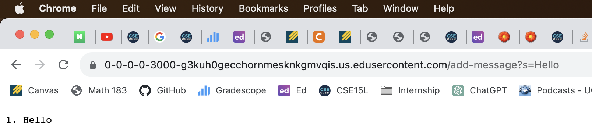
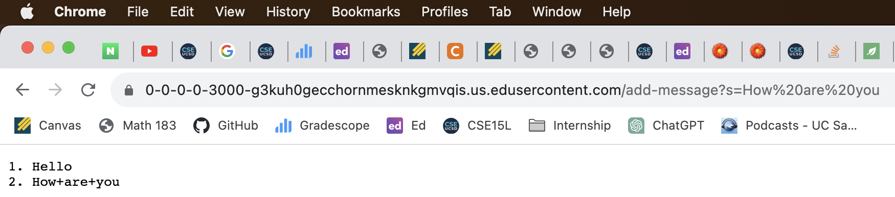
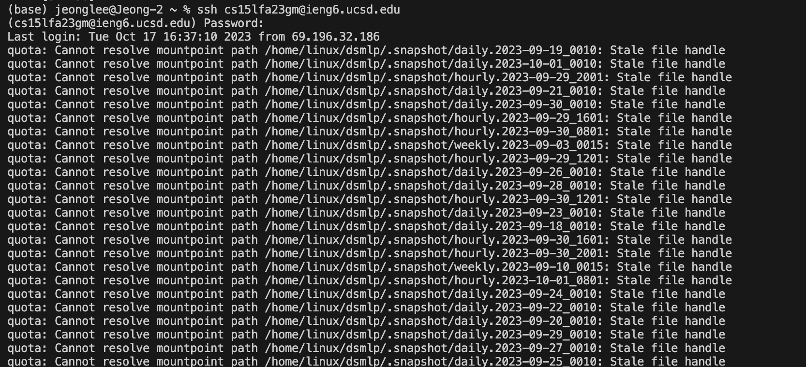
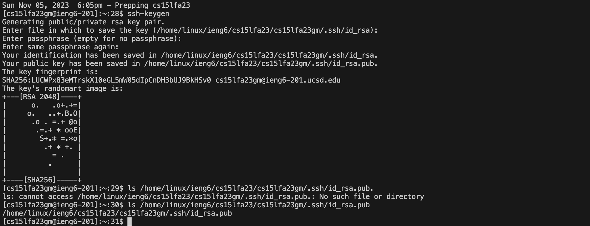
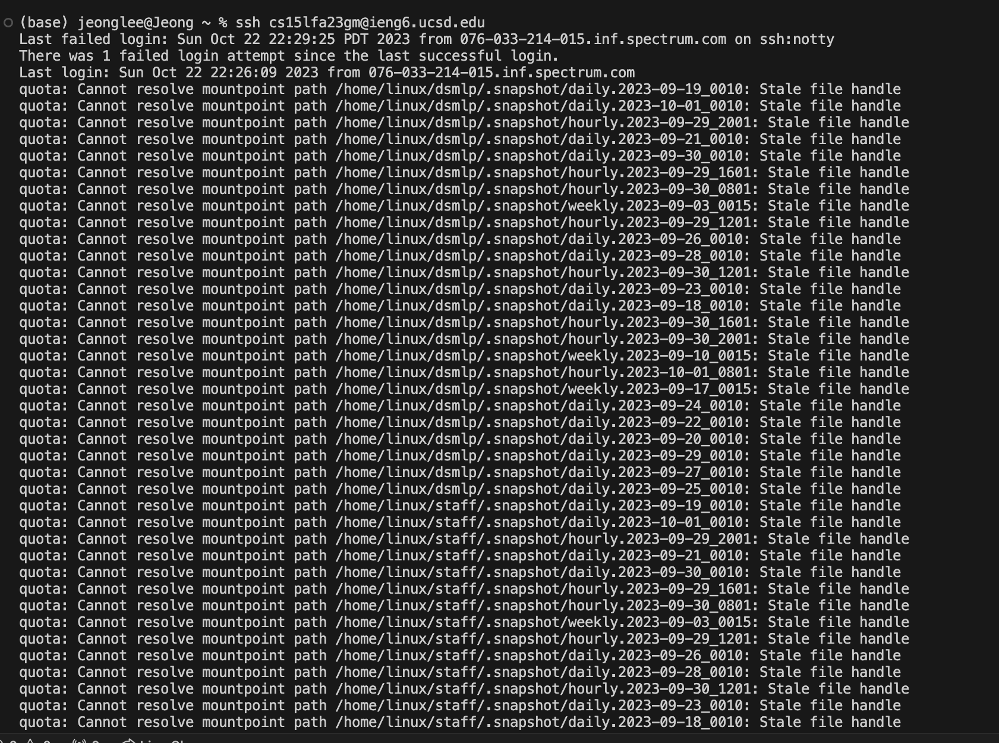

# Part 1

```
import java.io.IOException;
import java.net.URI;
import java.util.Scanner;

class Handler implements URLHandler {
    String str = "";
    int num = 0;
    public String handleRequest(URI url) {
        if (url.getPath().equals("/add-message")) {
            String[] parameters = url.getQuery().split("=");
            if (parameters[0].equals("s")) {
                num += 1;
                String num1 = Integer.toString(num);
                str += num1 + ". " + parameters[1] + "\n";
                return str;
            }
        }
        return "404 Not Found!";
    }
}

class StringServer {
    public static void main(String[] args) throws IOException {
        if(args.length == 0){
            System.out.println("Missing port number!");
            return;
        }

        int port = Integer.parseInt(args[0]);

        Server.start(port, new Handler());
    }
}
```


When a URL is sent, the method handleRequest is called. The relevant argument for this method is the link of the url which is the URI value. Num variable was 0 at first but it increments by 1 as we add string to the query. Str variable is an empty string but when the path is /add-message?s=<string>, str will add a new string from the query.



I couldn't figure out how to get rid of %20 or + when I had white spaces on the URL. When a URL is sent, the method handleRequest is called. The relevant argument for this method is the link of the url which is the URI value. Num variable increments by 1 as we add string to the query. If there are 2 strings, num variable will be 2 which is the same as the number of the strings that I added from the query. Str variable is an empty string but when the path is /add-message?s=<string>, str keeps adding a new string from the query. Therefore, it displays the whole strings that we added to the query on the screen in order.

# Part 2
  ## 2-1
  \
  \
  ## 2-2
  
  ## 2-3
  

# Part 3
I learned how to run servers on remote computers and how to access servers in easier way such as logging in without passwords. I also learned how to access URLs from the command line with using curl command. 

