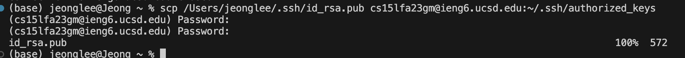

# Part 1

`import java.io.IOException;
import java.net.URI;
import java.util.Scanner;

class Handler implements URLHandler {
    String str = "";
    public String handleRequest(URI url) {
        if (url.getPath().equals("/add-message")) {
            String[] parameters = url.getQuery().split("=");
            if (parameters[0].equals("s")) {
                Scanner stringScanner = new Scanner(System.in);
                String str = stringScanner.next();
                return String.format("Input string is" + str);
            }
            Scanner stringScanner = new Scanner(System.in);
            String str = stringScanner.next();
            return String.format("Input string is" + str);
        }
        return "404 Not Found!";
    }
}

class StringServer {
    public static void main(String[] args) throws IOException {
        if(args.length == 0){
            System.out.println("Missing port number! Try any number between 1024 to 49151");
            return;
        }

        int port = Integer.parseInt(args[0]);

        Server.start(port, new Handler());
    }
}`
\
It should call url.getPath().equals method but because there was errors in my code, it only only returned and showed 404 NOt Found!.

# Part 2
  ## 2-1
  \
  \
  ## 2-2
  \
  ## 2-3
  \

# Part 3

