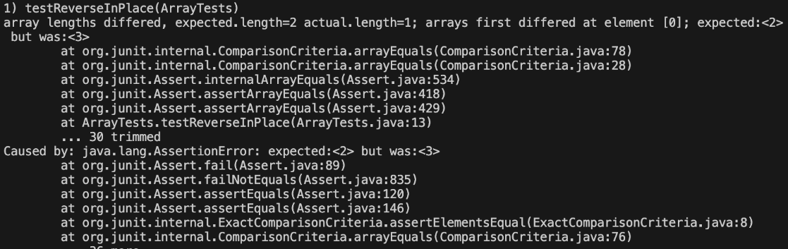
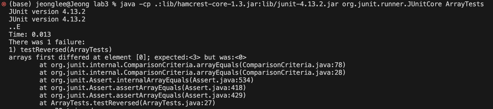
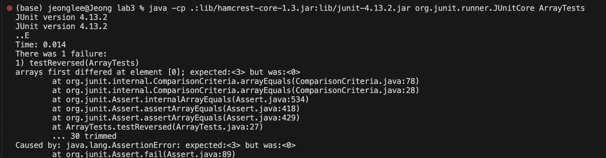

# Part 1
I chose ReverseInPlace.
This is failure inducing input for the buggy program.

```
public class ArrayTests {
  @Test 
  public void testReverseInPlace() {
    int[] input1 = { 3 };
    ArrayExamples.reverseInPlace(input1);
    assertArrayEquals(new int[]{ 3 }, input1);

    int[] input2 = { 1,2 };
    ArrayExamples.reverseInPlace(input2);
    assertArrayEquals(new int[]{ 2,1 }, input2);

    int[] input3 = { 2,3,4 };
    ArrayExamples.reverseInPlace(input3);
    assertArrayEquals(new int[]{ 4,3,2 }, input3);
  }
```

This is an input that doesn't induce failure.

```
public class ArrayTests {
	@Test 
	public void testReverseInPlace() {
    int[] input1 = { 3 };
    ArrayExamples.reverseInPlace(input1);
    assertArrayEquals(new int[]{ 3 }, input1);

    int[] input2 = { 1, 2 };
    ArrayExamples.reverseInPlace(input2);
    assertArrayEquals(new int[]{ 1, 2 }, input2);

    int[] input3 = { 2,3,4 };
    ArrayExamples.reverseInPlace(input3);
    assertArrayEquals(new int[]{ 2, 3, 4 }, input3);
	}
```



For the first failure inducing input, the length of the array should be 2 but the length was 1, and it should return {2, 1} but it only returned {1}. It means that the true values in the array doesn't match the expected values. It is because the method doesn't reverse array correctly. It overwrites the original array elements without keeping the original values.
An input that doesn't induce failure passed the test.

```
static void reverseInPlace(int[] arr) {
    for(int i = 0; i < arr.length/2; i += 1) {
      int temp = arr[i];
      arr[i] = arr[arr.length - i - 1];
      arr[arr.length - i - 1] = temp;
    }
  }
```

This is the revised code and the bug test result for reverseInPlace. Now it passes the test. The only error is from the testReversed test that I didn't revise. To fix the code, I used temporary variable to swap the elements. Also we only need a loop that runs only up to half of the length of an array to swap the elements correctly.


