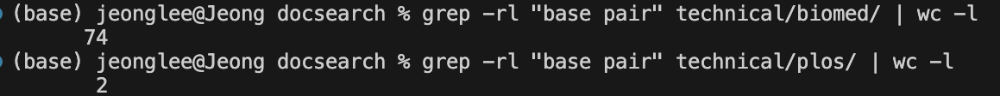
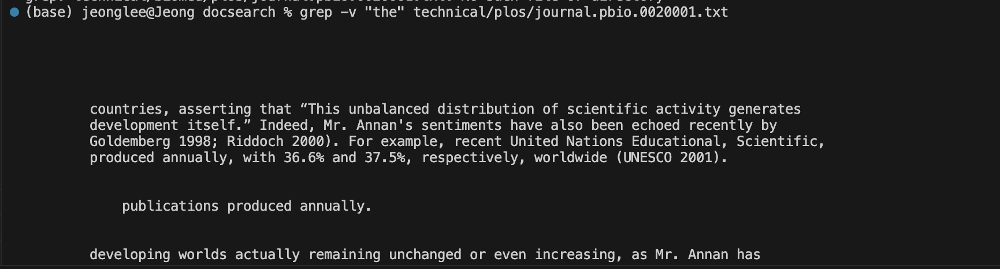
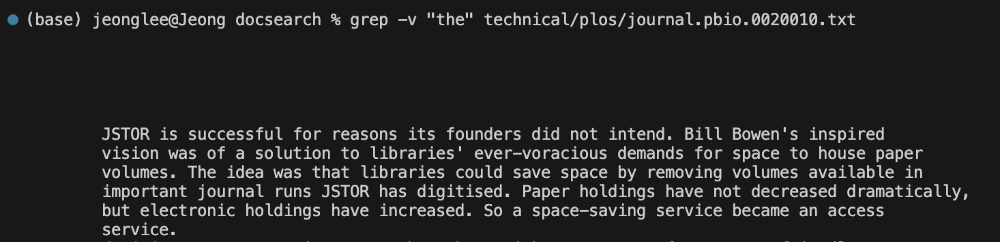
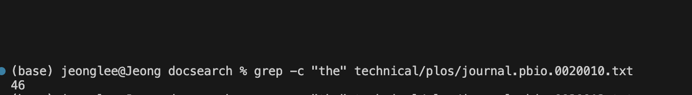
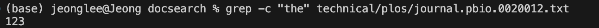
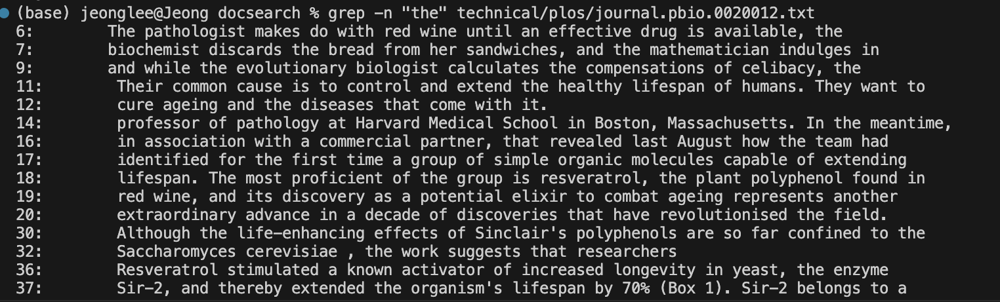
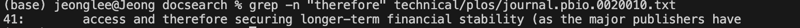

# Part 1
I chose ReverseInPlace.
This is failure inducing input for the buggy program.

```
public class ArrayTests {
  @Test 
  public void testReverseInPlace() {
    int[] input1 = { 3 };
    ArrayExamples.reverseInPlace(input1);
    assertArrayEquals(new int[]{ 3 }, input1);

    int[] input2 = { 1,2 };
    ArrayExamples.reverseInPlace(input2);
    assertArrayEquals(new int[]{ 2,1 }, input2);

    int[] input3 = { 2,3,4 };
    ArrayExamples.reverseInPlace(input3);
    assertArrayEquals(new int[]{ 4,3,2 }, input3);
  }
```

This is an input that doesn't induce failure.

```
public class ArrayTests {
	@Test 
	public void testReverseInPlace() {
    int[] input1 = { 3 };
    ArrayExamples.reverseInPlace(input1);
    assertArrayEquals(new int[]{ 3 }, input1);

    int[] input2 = { 1, 2 };
    ArrayExamples.reverseInPlace(input2);
    assertArrayEquals(new int[]{ 1, 2 }, input2);

    int[] input3 = { 2,3,4 };
    ArrayExamples.reverseInPlace(input3);
    assertArrayEquals(new int[]{ 2, 3, 4 }, input3);
	}
```


For the first failure inducing input, the length of the array should be 2 but the length was 1, and it should return {2, 1} but it only returned {1}. It means that the true values in the array doesn't match the expected values. It is because the method doesn't reverse array correctly. It overwrites the original array elements without keeping the original values.
An input that doesn't induce failure passed the test.

```
static void reverseInPlace(int[] arr) {
    for(int i = 0; i < arr.length/2; i += 1) {
      int temp = arr[i];
      arr[i] = arr[arr.length - i - 1];
      arr[arr.length - i - 1] = temp;
    }
  }
```

This is the revised code and the bug test result for reverseInPlace. Now it passes the test. The only error is from the testReversed test that I didn't revise. To fix the code, I used temporary variable to swap the elements. Also we only need a loop that runs only up to half of the length of an array to swap the elements correctly.

# Part 2
I chose grep command. Some lines are too long so I just added screenshots instead of codeblocks.
1. grep -rl

These are two examples of grep -rl command. I tried to find the number of files in technical/plos directory containing the string "base pair”. The second one was finding the number of files in technical/biomed directory that contains the string “base pair”. It is useful because we can find the number of files that contains certain string in certain directory.
Cite: From Week5 lab


2. grep -v


These are two examples of grep -v command. I used grep -v command to find all the lines in the file that don't contain the word "the". It is useful because we can easily include not matching results.
Cite: https://www.freecodecamp.org/news/grep-command-in-linux-usage-options-and-syntax-examples/

   
3. grep -c


These are two examples of grep -c command. I used grep -c command to find the number of occurence of the string in the file. It is useful because grep -c counts the number of times the matched string appears in the file.
Cite: https://www.freecodecamp.org/news/grep-command-in-linux-usage-options-and-syntax-examples/

   
4. grep -n


These are two examples of grep -n command. I used grep -n command to get the line numbers along with the matching strings from the file. It is useful because we can easily find where the string appears in the file.
Cite: https://www.freecodecamp.org/news/grep-command-in-linux-usage-options-and-syntax-examples/


