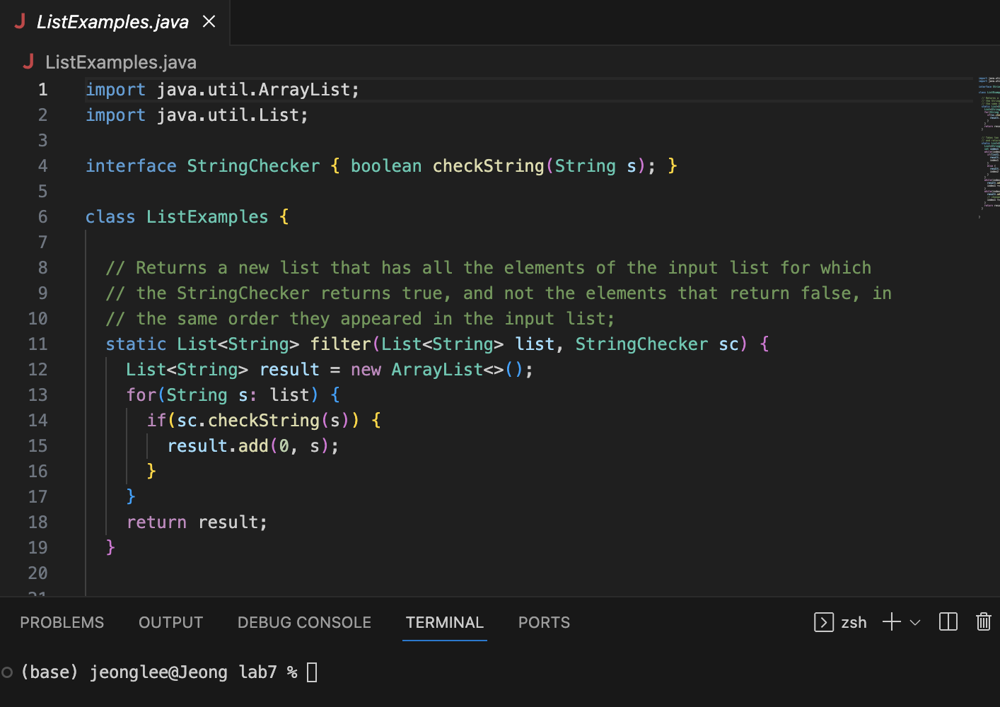
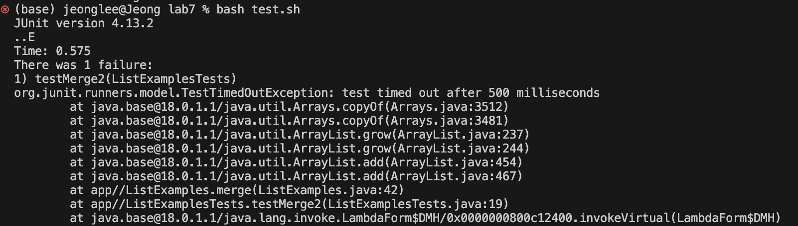
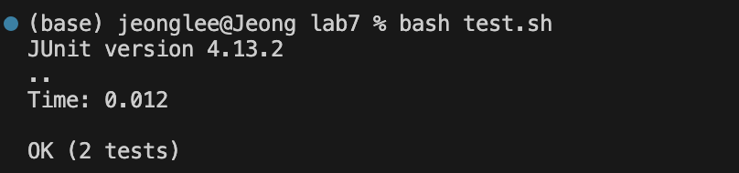

I forked the repository and cloned it.

I ran the bash script and test failed.

Using vim to change the code:
Changing index 1 to 2:  type vim ListExamples.java, press esc to be in a normal mode, type :44 to go to the line 44, e to go to the end of the line, press x to delete 2, press i to insert 1

I changed the code and it succeeded.

After this, I used github Desktop to commit the change to the repository.
