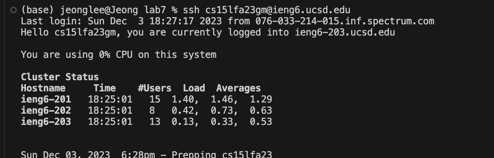

# Step 4

I logged into ieng6.

# Step 5

I cloned the fork of the repository from my Github account using the SSH URL.

# Step 6

I ran the bash script and test failed.

# Step 7

Using vim to change the code:
Type vim ListExamples.java then it will be a vim mode.
Changing index 1 to 2: press <j> until you get to the line 44. Press <l> to get the cursor next(right side) to 1 of index1. Press <i> to change to insert mode. Press <delete> key to delete 1 and press 2. Press <esc> to end the insert mode. Press <:wq> to save and quit vim mode.

# Step 8

I changed the code and it succeeded.

# Step 9

After this I used git add ListExamples.java, git commit -m "fix bugs", and git push origin main to commit and push the resulting change to my Git account, but "Support for password authentication was removed on August 13, 2021." issue happened.

