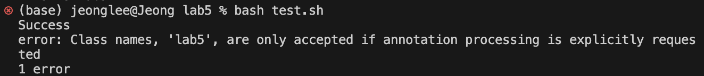
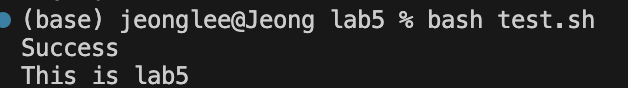

I created one java file and created one bash file that I can test java file.
# Step 1

# 1
Student: These are my java file and bash file. I tried to test out a simple java file whether it contains any error but it keeps giving me this error.
test.sh:
```
javac lab5.java

# Checking if compilation was successful
if [ $? -eq 0 ]; then
    echo "Success"
    javac lab5
else
    echo "Fail"
fi
```

lab5.java:
```
public class lab5{
    public static void main(String[] args) {
        
        System.out.println("This is lab5");
    }
}
```


# 2
I think it is because of your test.sh file. There is an error in this file on line 6. The javac command is used for compilation. That's why you first had javac lab5.java on your first line. You want to run your java program after it is compiled and show your output. Then you should write ```java lab5``` instead of ```javac lab5``` because java command is used to run the compiled java program. 

# 3

The bug was caused because of line 6 in test.sh file. It is because the student used ```javac``` instead of ```java``` command. The student wanted to run their java program after it is compiled and show the output of the program after testing out if the program compiles or not. In this case, they should use ```java``` command instead of ```javac```.

# 4
1. file, directory structure:
```
   lab5
       -test.sh
       -lab5.java
```
2. Files before fixing the bug
test.sh:
```
javac lab5.java

# Checking if compilation was successful
if [ $? -eq 0 ]; then
    echo "Success"
    javac lab5
else
    echo "Fail"
fi
```

lab5.java:
```
public class lab5{
    public static void main(String[] args) {
        
        System.out.println("This is lab5");
    }
}
```
3. Command run to trigger the bug: ```bash test.sh```
4. The bug was caused because of line 6 in test.sh file. It is because the student used ```javac``` instead of ```java``` command. The student wanted to run their java program after it is compiled and show the output of the program after testing out if the program compiles or not. In this case, they should use ```java``` command instead of ```javac```. The fixed code will be:
```
javac lab5.java

if [ $? -eq 0 ]; then
    echo "Success"
    java lab5
else
    echo "Fail"
fi
```
